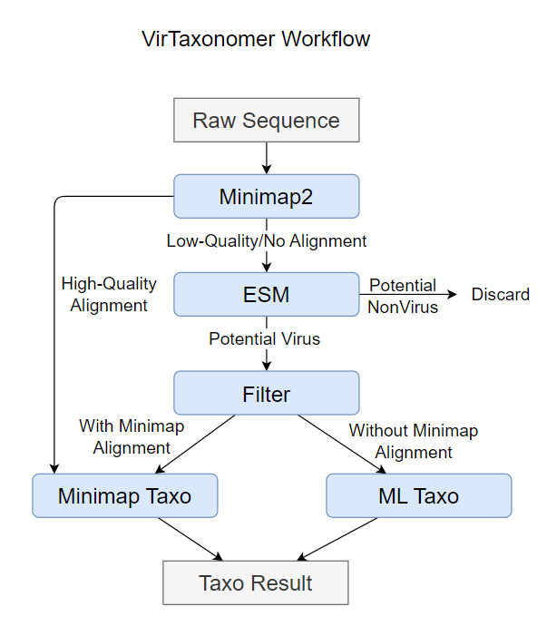

# VirTaxonomer

A deep-learning based model to taxonomize virus

### 1. Model Architecture

VirTaxonomer consists of two major modules: the `Virus Identification Module` and the `Virus Classification Module`.

#### Virus Identification Module

The Virus Identification Module is composed of two components: the `Minimap component` and the `ESM prediction component`. For each sequence:

1. Minimap checks whether the sequence can be aligned to a reference sequence in VMRv4.
2. If the alignment quality is low, the ESM component determines whether the sequence belongs to a virus.

#### Virus Classification Module

The Virus Classification Module also has two components: the `Minimap component` and the `machine learning component`.

1. Sequences with high-quality alignments from Minimap are classified directly according to the corresponding species.
2. For sequences without high-quality alignments, machine learning models are used to classify them. Specifically, we train models for each taxonomic rank (realm, kingdom, phylum, etc.).

### 2. Overall Workflow

The overall workflow of VirTaxonomer is illustrated below.



### 3. How to run VirTaxonomer

*Note*: running VirTaxonomer on GPU is highly recommended.

#### Download models

You can download our models from [https://zenodo.org/records/14649352](https://zenodo.org/records/14649352), extract them and put the files in the corresponding folder

```
model_root
├── class
│   └── esm2_t33_512
│       ├── config.json
│       ├── pytorch_model.bin
│       └── vocab.txt
├── family
│   └── esm2_t33_512
│       ├── config.json
│       ├── pytorch_model.bin
│       └── vocab.txt
├── genus
│   └── esm2_t33_256
│       ├── config.json
│       ├── pytorch_model.bin
│       └── vocab.txt
├── kingdom
│   └── esm2_t33_256
│       ├── config.json
│       ├── pytorch_model.bin
│       └── vocab.txt
├── mapping
│   ├── VMR_MSL39_v4.json.processed_data.json.nosub_addunknown.json
│   ├── VMR_MSL39_v4.json.processed_data.json.nosub_addunknown.jsonClass_mapping.csv
│   ├── VMR_MSL39_v4.json.processed_data.json.nosub_addunknown.jsonFamily_mapping.csv
│   ├── VMR_MSL39_v4.json.processed_data.json.nosub_addunknown.jsonGenus_mapping.csv
│   ├── VMR_MSL39_v4.json.processed_data.json.nosub_addunknown.jsonKingdom_mapping.csv
│   ├── VMR_MSL39_v4.json.processed_data.json.nosub_addunknown.jsonOrder_mapping.csv
│   ├── VMR_MSL39_v4.json.processed_data.json.nosub_addunknown.jsonPhylum_mapping.csv
│   └── VMR_MSL39_v4.json.processed_data.json.nosub_addunknown.jsonRealm_mapping.csv
├── order
│   └── esm2_t33_512
│       ├── config.json
│       ├── pytorch_model.bin
│       └── vocab.txt
├── phylum
│   └── esm2_t33_512
│       ├── config.json
│       ├── pytorch_model.bin
│       └── vocab.txt
├── realm
│   └── esm2_t33_512
│       ├── config.json
│       ├── pytorch_model.bin
│       └── vocab.txt
├── viral_identify
│   └── esm2_t30_512
│       ├── config.json
│       ├── pytorch_model.bin
│       └── vocab.txt
└── VMRv4
    ├── VMRv4.fasta
    └── VMRv4_names.json
```

#### Setup the environment

Conda is highly recommended, or you can install required dependencies according to the `environment.yml`

```
conda env create -f environment.yml
conda activate VirTaxonomer
conda install minimap2 prodigal-gv -c bioconda
```

*Note*: The version of minimap2 may change the performance of our model. We use version 2.28.

#### Select parameters

You can directly modify the parameters in `runVirTaxonomer.sh`. 

**These parameters are supposed to be modified:**

- `fasta_path`: where to find the fasta file to predict
- `model_path`: the path of model root folder
- `output_path`: the path of output folder

**The following parameters can be modified optionally:**

- `ML_strategy`: the value can be `highest` or `bottomup`, which changes how the machine learning component works
- `restrict`: the value can be `genus` or `species`, which restricts the output rank
- `batch_size`: the batch size for the machine learning component

**If you want to get the same result as our provided, use the following parameters:**

- Result 1: `ML_strategy=bottomup`, `restrict=genus`
- Result 2: `ML_strategy=bottomup`, `restrict=species`
- Result 3: `ML_strategy=highest`, `restrict=genus`

**If you want to use specific GPU(s), you can add an extra line before `python ./code/main.py`:**

```
export CUDA_VISIBLE_DEVICES=0,1,2,...,n 	# n is the number of GPUs, or you can assign a specific GPU.
```

#### Run VirTaxonomer

Simply run `runVirTaxonomer.sh` and get your results!


